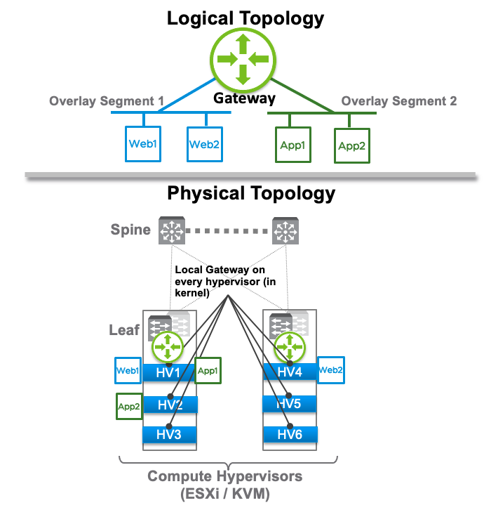
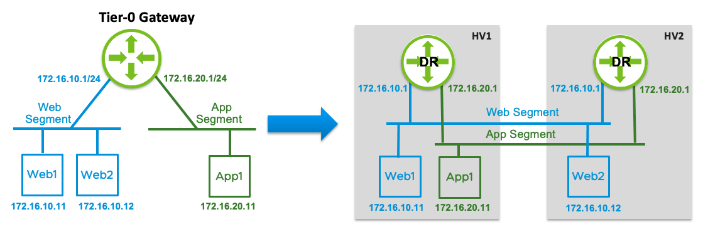
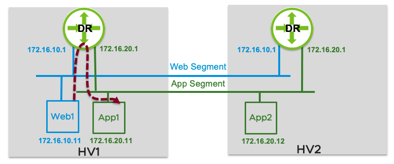
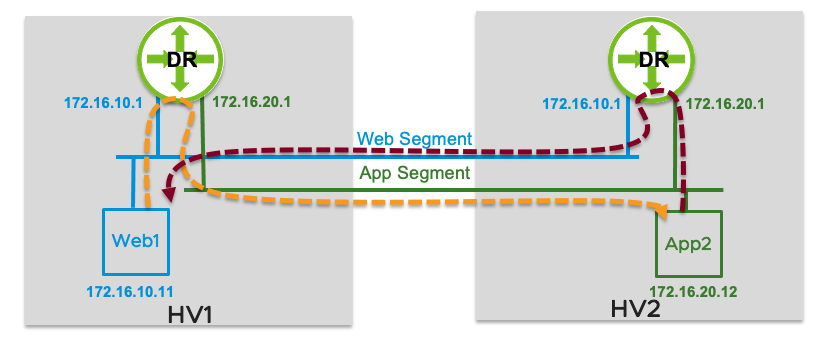
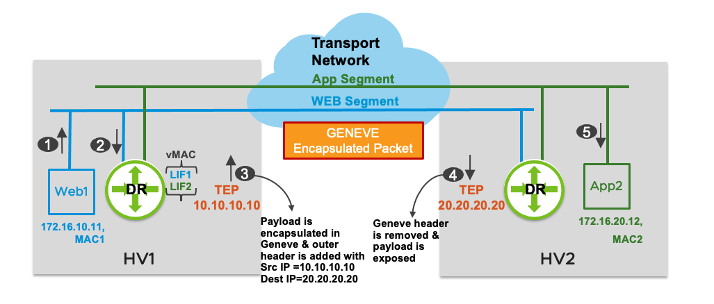
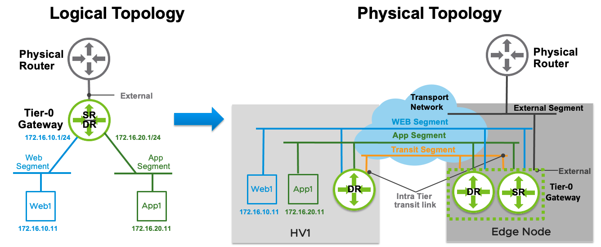
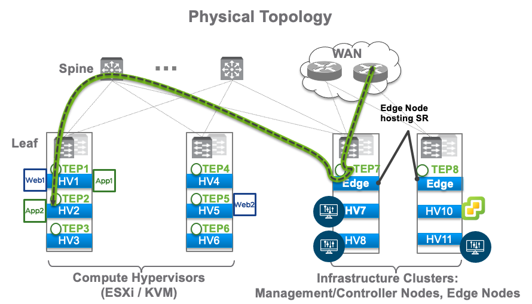
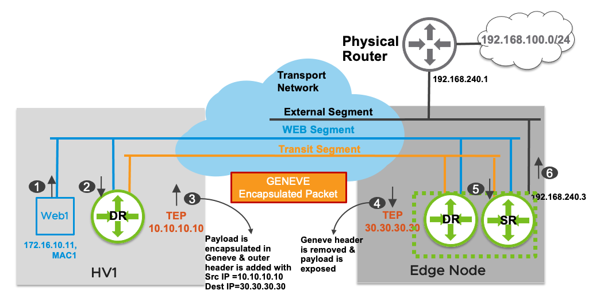
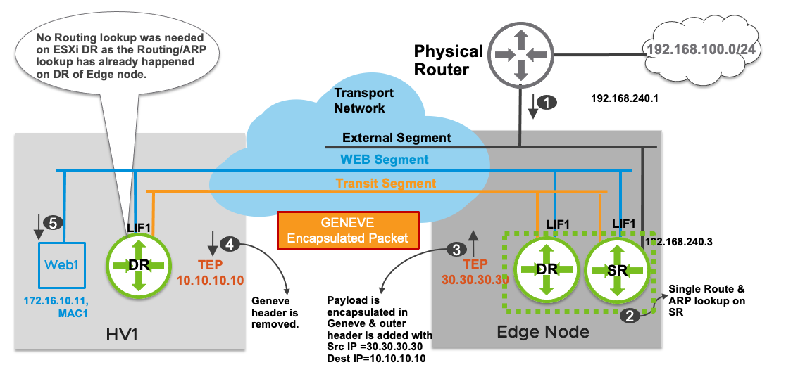

**Table Of Contents**

<!--ts-->
   * [4 - NSX-T Routing](#4-nsx-t-logical-routing)
     * [4.1 - NSX-T Single Tier Routing](#41-single-tier-routing)
       * [4.1.1 - Distributed Router (DR)](#411-distributed-router-dr)
       * [4.1.2 - Services Router (SR)](#412-services-router-sr)
     * [4.2 - NSX-T Multi Tier Routing](#42-single-tier-routing)

# 4 NSX-T Logical Routing

The logical routing capability in the NSX-T platform provides the ability to interconnect both virtual and physical workloads deployed in different logical L2 networks. NSX-T enables the creation of network elements like segments (Layer 2 broadcast domains) and gateways (routers) in software as logical constructs and embeds them in the hypervisor layer, abstracted from the underlying physical hardware. Since these network elements are logical entities, multiple gateways can be created in an automated and agile fashion.
 
The previous chapter showed how to create segments; this chapter focuses on how gateways provide connectivity between different logical L2 networks. Figure 4-1 shows both logical and physical view of a routed topology connecting segments/logical switches on multiple hypervisors. Virtual machines “Web1” and “Web2” are connected to “overlay Segment 1” while “App1” and “App2” are connected to “overlay Segment 2”. 

    

Figure 4‑1: Logical and Physical View of Routing Services

In a data center, traffic is categorized as East-West (E-W) or North-South (N-S) based on the origin and destination of the flow. When virtual or physical workloads in a data center communicate with the devices external to the data center (e.g., WAN, Internet), the traffic is referred to as North-South traffic. The traffic between workloads confined within the data center is referred to as East-West traffic. In modern data centers, more than 70% of the traffic is East-West.

For a multi-tiered application where the web tier needs to talk to the app tier and the app tier needs to talk to the database tier and, these different tiers sit in different subnets. Every time a routing decision is made, the packet is sent to the router. Traditionally, a centralized router would provide routing for these different tiers. With VMs that are hosted on same the ESXi or KVM hypervisor, traffic will leave the hypervisor multiple times to go to the centralized router for a routing decision, then return to the same hypervisor; this is not optimal.

NSX-T is uniquely positioned to solve these challenges as it can bring networking closest to the workload. Configuring a Gateway via NSX-T Manager instantiates a local distributed gateway on each hypervisor. For the VMs hosted (e.g., “Web 1”, “App 1”) on the same hypervisor, the E-W traffic does not need to leave the hypervisor for routing.

## 4.1 Single Tier Routing

NSX-T Gateway provides optimized distributed routing as well as centralized routing and services like NAT, AVI Load balancer, DHCP server etc. A single tier routing topology implies that a Gateway is connected to segments southbound providing E-W routing and is also connected to physical infrastructure to provide N-S connectivity. This gateway is referred to as Tier-0 Gateway. 

Tier-0 Gateway consists of two components: distributed routing component (DR) and centralized services routing component (SR).

### 4.1.1 Distributed Router (DR)

A DR is essentially a router with logical interfaces (LIFs) connected to multiple subnets. It runs as a kernel module and is distributed in hypervisors across all transport nodes, including Edge nodes. The traditional data plane functionality of routing and ARP lookups is performed by the logical interfaces connecting to the different segments. Each LIF has a vMAC address and an IP address being the default IP gateway for its connected segment. The IP address is unique per LIF and remains the same everywhere the segment exists. The vMAC associated with each LIF remains constant in each hypervisor, allowing the default gateway IP and MAC addresses to remain the same during vMotion. 

The left side of Figure 4-2 shows a logical topology with two segments, “Web Segment” with a default gateway of 172.16.10.1/24 and “App Segment” with a default gateway of 172.16.20.1/24 are attached to Tier-0 Gateway. In the physical topology view on the right, VMs are shown on two hypervisors, “HV1” and “HV2”.  A distributed routing (DR) component for this Tier-0 Gateway is instantiated as a kernel module and will act as a local gateway or first hop router for the workloads connected to the segments. Please note that the DR is not a VM and the DR on both hypervisors has the same IP addresses.

    

Figure 4‑2: E-W Routing with Workloads on the same Hypervisor

**East-West Routing - Distributed Routing with Workloads on the Same Hypervisor**

In this example, “Web1” VM is connected to “Web Segment” and “App1” is connected to “App-Segment” and both VMs are hosted on the same hypervisor. Since “Web1” and “App1” are both hosted on hypervisor “HV1”, routing between them happens on the DR located on that same hypervisor.

Figure 4-3 presents the logical packet flow between two VMs on the same hypervisor

    

Figure 4‑3: Packet Flow between two VMs on same Hypervisor

1.	“Web1” (172.16.10.11) sends a packet to “App1” (172.16.20.11). The packet is sent to the default gateway interface (172.16.10.1) for “Web1” located on the local DR. 
2.	The DR on “HV1” performs a routing lookup which determines that the destination subnet 172.16.20.0/24 is a directly connected subnet on “LIF2”. A lookup is performed in the “LIF2” ARP table to determine the MAC address associated with the IP address for “App1”. If the ARP entry does not exist, the controller is queried. If there is no response from controller, an ARP request is flooded to learn the MAC address of “App1”.
3.	Once the MAC address of “App1” is learned, the L2 lookup is performed in the local MAC table to determine how to reach “App1” and the packet is delivered to the App1 VM. 
4.	The return packet from “App1” follows the same process and routing would happen again on the local DR.

In this example, neither the initial packet from “Web1” to “App1” nor the return packet from “App1” to “Web1” left the hypervisor.

**East-West Routing - Distributed Routing with Workloads on Different Hypervisor**

In this example, the target workload “App2” differs as it rests on a hypervisor named “HV2”. If “Web1” needs to communicate with “App2”, the traffic would have to leave the hypervisor “HV1” as these VMs are hosted on two different hypervisors. Figure 4-4 shows a logical view of topology, highlighting the routing decisions taken by the DR on “HV1” and the DR on “HV2”.
When “Web1” sends traffic to “App2”, routing is done by the DR on “HV1”. The reverse traffic from “App2” to “Web1” is routed by DR on “HV2”. Routing is performed on the hypervisor attached to the source VM.

    

Figure 4‑4: E-W Packet Flow between two Hypervisors

Figure 4-5 shows the corresponding physical topology and packet walk from “Web1” to “App2”.

    

Figure 4‑5: End-to-end E-W Packet Flow

1.	“Web1” (172.16.10.11) sends a packet to “App2” (172.16.20.12). The packet is sent to the default gateway interface (172.16.10.1) for “Web1” located on the local DR. Its L2 header has the source MAC as “MAC1” and destination MAC as the vMAC of the DR. This vMAC will be the same for all LIFs.
2.	The routing lookup happens on the HV1 DR, which determines that the destination subnet 172.16.20.0/24 is a directly connected subnet on “LIF2”. A lookup is performed in the “LIF2” ARP table to determine the MAC address associated with the IP address for “App2”. This destination MAC, “MAC2”, is learned via the remote HV2 TEP 20.20.20.20.
3.	HV1 TEP encapsulates the original packet and sends it to the HV2 TEP with a source IP address of 10.10.10.10 and destinations IP address of 20.20.20.20 for the encapsulating packet. The destination virtual network identifier (VNI) in the Geneve encapsulated packet belongs to “App Segment”.
4.	HV2 TEP 20.20.20.20 decapsulates the packet, removing the outer header upon reception. It performs an L2 lookup in the local MAC table associated with “LIF2”. 
5.	Packet is delivered to “App2” VM.

The return packet from “App2” destined for “Web1” goes through the same process. For the return traffic, the routing lookup happens on the HV2 DR. This represents the normal behavior of the DR, which is to always perform routing on the DR instance running in the kernel of the hypervisor hosting the workload that initiates the communication. After the routing lookup, the packet is encapsulated by the HV2 TEP and sent to the remote HV1 TEP. The HV1 decapsulates the Geneve packet and delivers the encapsulated frame from “App2” to “Web1”.

### 4.1.2 Services Router (SR)

East-West routing is completely distributed in the hypervisor, with each hypervisor in the transport zone running a DR in its kernel. However, some services of NSX-T are not distributed, due to its locality or stateful nature such as:

* Physical infrastructure connectivity (BGP Routing with Address Families – VRF lite)
* NAT
* DHCP server
* VPN
* Gateway Firewall
* Bridging
* Service Interface
* Metadata Proxy for OpenStack

A services router (SR) is instantiated on an edge cluster when a service is enabled that cannot be distributed on a gateway. 

A centralized pool of capacity is required to run these services in a highly available and scaled-out fashion. The appliances where the centralized services or SR instances are hosted are called Edge nodes. An Edge node is the appliance that provides connectivity to the physical infrastructure.

Left side of Figure 4-6 shows the logical view of a Tier-0 Gateway showing both DR and SR components when connected to a physical router. Right side of Figure 4-6 shows how the components of Tier-0 Gateway are realized on Compute hypervisor and Edge node. Note that the compute host (i.e. HV1) has just the DR component and the Edge node shown on the right has both the SR and DR components. SR/DR forwarding table merge has been done to address future use-cases. SR and DR functionality remains the same after SR/DR merge in NSX-T 2.4 release, but with this change SR has direct visibility into the overlay segments. Notice that all the overlay segments are attached to the SR as well.

    

Figure 4‑6: Logical Router Components and Interconnection

A Tier-0 Gateway can have following interfaces:
* External Interface – Interface connecting to the physical infrastructure/router. Static routing and BGP are supported on this interface. This interface was referred to as uplink interface in previous releases. This interface can also be used to extend a VRF (Virtual routing and forwarding instance) from the physical networking fabric into the NSX domain.
* Service Interface: Interface connecting VLAN segments to provide connectivity and services to VLAN backed physical or virtual workloads. Service interface can also be connected to overlay segments for Tier-1 standalone load balancer use-cases explained in Load balancer Chapter 6 . This interface was referred to as centralized service port (CSP) in previous releases. Note that a gateway must have a SR component to realize service interface.  NSX-T 3.0 supports static and dynamic routing over this interface.
* Linked Segments – Interface connecting to an overlay segment. This interface was referred to as downlink interface in previous releases. Static routing is supported over that interface
* Intra-Tier Transit Link (Internal link between the DR and SR). A transit overlay segment is auto plumbed between DR and SR and each end gets an IP address assigned in 169.254.0.0/24 subnet by default. This address range is configurable only when creating the Tier-0 gateway.

As mentioned previously, connectivity between DR on the compute host and SR on the Edge node is auto plumbed by the system. Both the DR and SR get an IP address assigned in 169.254.0.0/24 subnet by default. The management plane also configures a default route on the DR with the next hop IP address of the SR’s intra-tier transit link IP. This allows the DR to take care of E-W routing while the SR provides N-S connectivity.

**North-South Routing by SR Hosted on Edge Node**

From a physical topology perspective, workloads are hosted on hypervisors and N-S connectivity is provided by Edge nodes. If a device external to the data center needs to communicate with a virtual workload hosted on one of the hypervisors, the traffic would have to come to the Edge nodes first. This traffic will then be sent on an overlay network to the hypervisor hosting the workload. Figure 4-7 shows the traffic flow from a VM in the data center to an external physical infrastructure.

    

Figure 4‑7: N-S Routing Packet Flow

Figure 4-8 shows a detailed packet walk from data center VM “Web1” to a device on the L3 physical infrastructure. As discussed in the E-W routing section, routing always happens closest to the source. In this example, eBGP peering has been established between the physical router interface with the IP address 192.168.240.1 and the Tier-0 Gateway SR component hosted on the Edge node with an external interface IP address of 192.168.240.3. Tier-0 Gateway SR has a BGP route for 192.168.100.0/24 prefix with a next hop of 192.168.240.1 and the physical router has a BGP route for 172.16.10.0/24 with a next hop of 192.168.240.3. 

    

Figure 4‑8: End-to-end Packet Flow – Application “Web1” to External

1.	“Web1” (172.16.10.11) sends a packet to 192.168.100.10. The packet is sent to the “Web1” default gateway interface (172.16.10.1) located on the local DR. 
2.	The packet is received on the local DR. DR doesn’t have a specific connected route for 192.168.100.0/24 prefix. The DR has a default route with the next hop as its corresponding SR, which is hosted on the Edge node. 
3.	The HV1 TEP encapsulates the original packet and sends it to the Edge node TEP with a source IP address of 10.10.10.10 and destination IP address of 30.30.30.30.
4.	The Edge node is also a transport node. It will encapsulate/decapsulate the traffic sent to or received from compute hypervisors. The Edge node TEP decapsulates the packet, removing the outer header prior to sending it to the SR.
5.	The SR performs a routing lookup and determines that the route 192.168.100.0/24 is learned via external interface with a next hop IP address 192.168.240.1. 
6.	The packet is sent on the VLAN segment to the physical router and is finally delivered to 192.168.100.10.

Observe that routing and ARP lookup happens on the DR hosted on the HV1 hypervisor to determine that the packet must be sent to the SR. On the edge node, the packet is directly sent to the SR after the tunnel encapsulation has been removed.

Figure 4-9 follows the packet walk for the reverse traffic from an external device to “Web1”.

    

Figure 4‑9: End-to-end Packet Flow – Application “Web1” to External

1.	An external device (192.168.100.10) sends a packet to “Web1” (172.16.10.11). The packet is routed by the physical router and sent to the external interface of Tier-0 Gateway hosted on Edge node.
2.	A single routing lookup happens on the Tier-0 Gateway SR which determines that 172.16.10.0/24 is a directly connected subnet on “LIF1”. A lookup is performed in the “LIF1” ARP table to determine the MAC address associated with the IP address for “Web1”. This destination MAC “MAC1” is learned via the remote TEP (10.10.10.10), which is the “HV1” host where “Web1” is located.
3.	The Edge TEP encapsulates the original packet and sends it to the remote TEP with an outer packet source IP address of 30.30.30.30 and destination IP address of 10.10.10.10. The destination VNI in this Geneve encapsulated packet is of “Web Segment”.
4.	The HV1 host decapsulates the packet and removes the outer header upon receiving the packet. An L2 lookup is performed in the local MAC table associated with “LIF1”.
5.	The packet is delivered to Web1.

This time routing and ARP lookup happened on the merged SR/DR hosted on the Edge node. No such lookup was required on the DR hosted on the HV1 hypervisor, and packet was sent directly to the VM after removing the tunnel encapsulation header.

Figure 4-9 showed a Tier-0 gateway with one external interface that leverages Edge node to connect to physical infrastructure. If this Edge node goes down, N-S connectivity along with other centralized services running on Edge node will go down as well. 

To provide redundancy for centralized services and N-S connectivity, it is recommended to deploy a minimum of two edge nodes. High availability modes are discussed in section 4.6 .

## 4.2 Multi Tier Routing